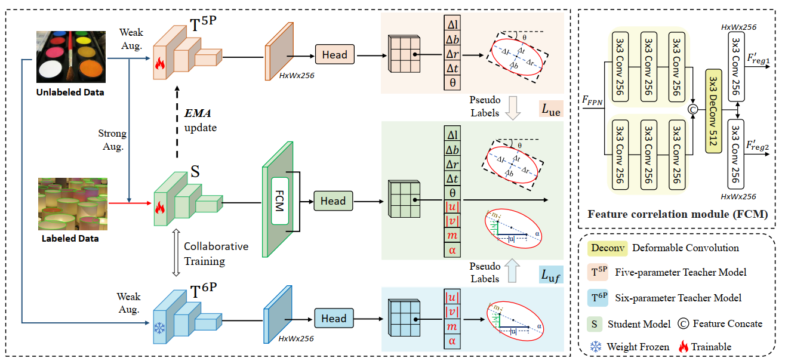

# DTCG
Official code of ACM MM2024 paper- Two Teachers are Better Than One: Semi-supervised Elliptical Object Detection by Dual-Teacher Collaborative Guidance.

# Introduction
Elliptical Object Detection (EOD) is crucial yet challenging due to complex scenes and varying object characteristics. Existing methods often struggle with parameter configurations and lack adaptability in label-scarce scenarios. To address this, a new semi-supervised teacher-student framework, Dual-Teacher Collaborative Guidance (DTCG), is proposed, comprising a five-parameter teacher detector, a six-parameter teacher detector, and a student detector. This allows the two teachers, specializing in different regression approaches, to co-instruct the student within a unified model, preventing errors and enhancing performance. Additionally, a feature correlation module (FCM) highlights differences between teacher features and employs deformable convolution to select advantageous features for final parameter regression. A collaborative training strategy (CoT) updates the teachers asynchronously, breaking through training and performance bottlenecks. Extensive experiments conducted on two widely recognized datasets affirm the superior performance of our DTCG over other leading competitors across various semi-supervised scenarios. Notably, our method achieves a 5.61% higher performance than the second best method when utilizing only 10% annotated data.




# Training
Code and Config are now available. You could train DTCG with the following command:
```
CUDA_VISIBLE_DEVICES=0 python -m torch.distributed.launch --nnodes=1 \
--node_rank=0 --master_addr="127.0.0.1" --nproc_per_node=1 --master_port=25500 \
train.py \ configs/ssad_fcos/seod_traffic_10p.py
--launcher pytorch \
--work-dir xxx
```
Or train the supervised baseline via configs in `./configs/rotated_fcos/`.

## Data preparation
Firstly, you need to divide the labelled data from the unlabelled data. After split, the data folder should be organized as follows, we further need to create empty annotations files for unlabeled data via tools/data/dota/create_empty_annfiles.py
```
split_ss_data
├── train
│   ├── images
│   └── annos
├── val
│   ├── images
│   └── annos
├── train_10_labeled
│   ├── images
│   └── annos
└──train_10_unlabeled
    ├── images
    └── annos
```

## Todo
- [x] Release data list
- [x] Release train code & guide (coming soon)
- [x] Release models

## Acknowledgement
Many thanks to the brilliant works ([SOOD]( https://github.com/HamPerdredes/SOOD))!


## Citation

If you find this codebase helpful, please consider to cite:

```

```
